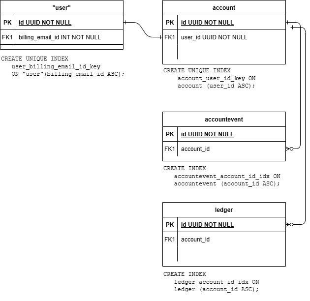

# Pay-Later Workload & Demo

## Demonstrating Improvements in Cost-To-Serve

## How I tested
I ran the pay-later workload on four different versions of the database.  On the 25.2 Beta, I ran the tests with and without write buffering.    For each version, I let the test run for 30 minutes and I repeated each test four times.


## Results
[Full Result Set](https://docs.google.com/spreadsheets/d/1Hp4e0OyFreTY2qML5ke1ri6XzeGS777wfHgl5yjDuzE/edit?gid=0#gid=0)


Mean Latency (the latency experienced by a cycle of the workload averaged out over the 30 minutes of the workload execution) consistently decreased while at the same time "Workload Executions/s" consistently increased.  


|Version (Advanced Clusters)	|Cluster Size (AWS us-east-2)	|Total vCPUs	|Concurrency	|Average "Mean Latency" (Per Workload Execution)	|Average "p99 Latency" (Per Workload Execution)	|Average "Mean Latency Writes / Second" (included in Workload)	|Average "Workload Executions / Second"	|SQL Queries / Second | Percent Increase from baseline (24.1.18) |
|--------|----------------------------------------------|---|---|-------|------|--------|------|----|----|								
|24.1.18	|6 Nodes x 4vCPU Per Node 800GiB Per Node	|24	|40	|267	|534	|141	|149	|2834 |Baseline
|24.3.12	|6 Nodes x 4vCPU Per Node 800GiB Per Node	|24	|40	|250	|451	|133	|160	|3035 |7.09%
|25.1.5	|6 Nodes x 4vCPU Per Node 800GiB Per Node	|24	|40	|231	|290	|126	|173	|3285 |15.91%
|v25.2.0-beta.3	|6 Nodes x 4vCPU Per Node 800GiB Per Node	|24	|40	|197	|359	|115	|202	|3846 |35.71%
|v25.2.0-beta.3	(write buffereing)|6 Nodes x 4vCPU Per Node 800GiB Per Node	|24	|40	|188	|335	|110	|212	|4033 |42.30%


# Reproducing the Tests
## Data Set
The data set included 4 tables and is approximitely 2.5 TiB.  
|Table | Number of Rows|Notes|
|------|---------------|----|
|"user"|100,000,000|Unique index on "billing_email_id"|
|account|100,000,000| One-to-one relationship with "user".|
|accountevent|1,000,000,000| One-to-many relationship with account|
|ledger|1,000,000,000|One-to-many relationship with account|

### High-Level ERD


## Populating the Database
To populate the database, you can choose to restore a backup or import the data.  In both cases, the data in stored in S3.
### Restoring from backups
The database can be restored from a backup stored in S3.  There are 2 versions of the backup available:
|Database Version|Backup Location|Restore Command
|------|-------------|-------------------|
|24.1|s3://nollen-bucket/workloads/backup-pay-later-database-24.1/|RESTORE DATABASE workload FROM LATEST in 's3://nollen-bucket/workloads/backup-pay-later-database-24.1/?AWS_ACCESS_KEY_ID={Key ID}&AWS_SECRET_ACCESS_KEY={Key}';|
|24.3|s3://nollen-bucket/workloads/backup-pay-later-database-24.3/|RESTORE DATABASE workload FROM LATEST in 's3://nollen-bucket/workloads/backup-pay-later-database-24.3/?AWS_ACCESS_KEY_ID={Key ID}&AWS_SECRET_ACCESS_KEY={Key}';|

### Importing the Data
If you would rather import the data rather than restoring a backup start by creating the DDL
#### DDL
Start by creating the tables [DDL](pay-later-ddl.txt).
#### Import the data
|Table|Import Command|
|-----|--------------|
|"user"|[IMPORT INTO "user"](IMPORT-INTO-user.txt)|
|account|[IMPORT INTO account](IMPORT-INTO-account.txt)|
|accountevent|[IMPORT INTO accountevent](IMPORT-INTO-accountevent.txt)|
|ledger|[IMPORT INTO ledger](IMPORT-INTO-ledger.txt)|

## Workload
Run the workload from a server that has access to the database.  You'll need to have `dbworkload` installed and running on your server.   

```
nohup dbworkload run -w pay_later.py --uri $CRDB_ADVANCED_URL -c 40 -d 1800 > dbworkload-run.log 2>&1 &
```

Due to the way that `dbworkload` runs, the "setup" step, which is a lengthy process, is included in the final average outout.   Therefore, that final average output cannot be used.  I manually collect the individual output and manully compute the averages.  

### Workload Description
The workload`pay-later`  is designed to simulate a small portion of the load test run by a customer and performs the following 19 statements (9 select, 6 insert):

1.  get_customer_by_email
2.  get_account_events
3.  get_account_status
4.  get_account_and_events_1yr
5.  get_ledger_details
6.  get_ledger_total
7.  get_merchant_info
8.  get_chargebacks
9.  get_ledger_balances_by_year
10. put_user_and_details (inserts 1 user record, 1 account record, 5 accountevent records and 3 ledger records)